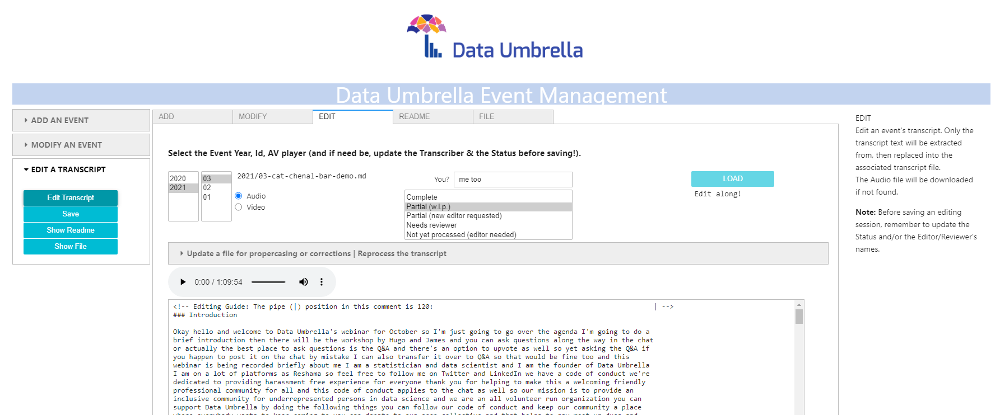

## Hi there 👋, I'm Cat Chenal

<!--
**CatChenal/CatChenal** is a ✨ _special_ ✨ repository because its `README.md` (this) appears on your GitHub profile.

Here are some ideas to get you started:
- 👯 I’m looking to collaborate on ...
- 🤔 I’m looking for help with ...
- 💬 Ask me about ...
- 📫 How to reach me: ...
- 🔭 I’m currently working on ...

I'm on Github!

 You can view my resume <a href='no cv link yet ' target=_blank><u>here</u>.</a>

-->

- ✨ Learn + make => know better
- 🌱 I’m currently learning Causal Inference, Big Data on Clouds...
- 😄 Pronouns: she/her
- 🎓 I'm Doctor Cat! Ph.D Biochemistry/Computational Biophysics

 
 

<!-- updated 1/18/23:
[Fix] fix github rate limiter bug for readme stats
Readme stats issue: anuraghazra/github-readme-stats#2415
 -->

<!-- was:

User stats aggregated & displayed thanks to [@anuraghazra](https://github.com/anuraghazra/github-readme-stats) and [@rickstaa's vercel host](https://github.com/rickstaa).
-->

--- 

--- 
# DevOps
### ["Quick-clone" a conda env with `new_conda_env` - WIP](https://github.com/CatChenal/new_conda_env/blob/main/README.md)
# Data Science
### [Process automation demo: Data Umbrella EventManagement](https://github.com/CatChenal/DU-event-transcript-demo/blob/main/README.md)

### [Linear Programming: Feasible Region](https://github.com/CatChenal/Feasible_Region/blob/master/README.md)
### [Notes on Statistics](https://github.com/CatChenal/Statistics-in-Python/blob/master/README.md)
### [Geocoders Comparison](https://github.com/CatChenal/Geocoders_Comparison/blob/master/README.md)
### [OSCI rankings with company size](https://github.com/CatChenal/OSCI_Rankings/blob/master/README.md)
### [Examples using Socrata API for public data](https://github.com/CatChenal/NYCData/blob/master/README.md)

# Data Visualization
### ['Bar chasing': A bad animation example](https://github.com/CatChenal/Bar_Chasing/blob/master/README.md)
### [Mirrored bar plots for paired series](https://github.com/CatChenal/Mirrored_Barplots/blob/master/README.md)
### [Modified Yellowbrick report for evaluation of ML Models](https://github.com/CatChenal/Yellowbricks/blob/master/README.md)
### [Lorenz curve with Gini coefficient](https://github.com/CatChenal/Lorenz_Gini_P_curve/blob/master/README.md)
### [Embedding bokeh plots into jinja templates](https://github.com/CatChenal/Bokeh_of_Irises/blob/master/README.md)
### [Earlier visualizations](https://github.com/CatChenal/DataVis/blob/master/README.md)

# Other
### [Fun image processing!](https://github.com/CatChenal/aquarelle) :NEW:  
### [Tips and tricks about Jupyter/JupyterLab notebooks (Recipes and Lab Templates)](https://github.com/CatChenal/Jupyter_Sphere/blob/master/README.md)
### [Unix timestamp conversion](https://github.com/CatChenal/convert_chrome_time/blob/master/README.md)
